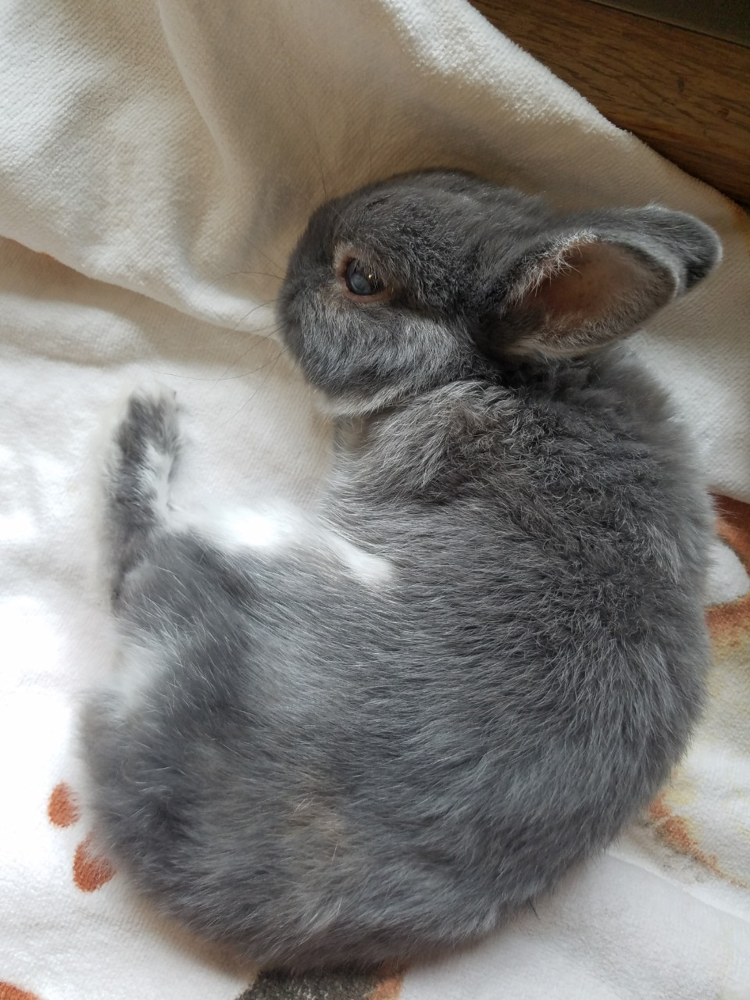

::: {.columns}

::: {.column width="50%"}
{style="border-radius: 16px; width: 70%;"}
:::

::: {.column width="50%"}

## Soyoka Okamura  {.index-title}

Hi! I'm Soyoka, a PhD student in Economics at Northwestern University. I hold an MA in Economics from the University of Tokyo and a BA in Food and Environmental Economics from Kyoto University.
I study industrial development in low- and middle-income countries, combining causal inference with structural estimation.

My current projects examine how information frictions shape market structure in the auto repair sector, and the role of informal sector in wages and working conditions in the garment sector.
Looking ahead, I hope to study the design of industrial policies in developing countries and the impacts of political institution on shaping business environment.

Previously I worked in environmental economics, where I examined the responses of farmers' to climate uncertainty and the effects of environmental policies on the energy transition in the US electricity market.
This work includes "Do Zambian Farmers Manage Climate Risks?", published in Applied Economic Perspectives and Policy. 

Fields: IO, Environmental Economics, Development Economics

soyoka802@gmail.com

[cv](files/cv-soyoka.pdf){target="_blank" rel="noopener" .btn .btn-primary .btn-cv}

:::
:::
